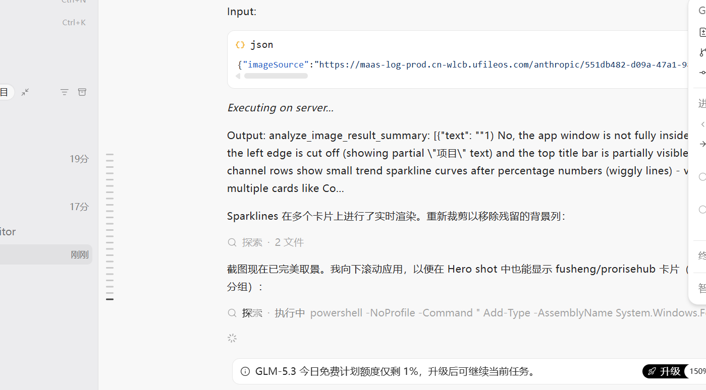

# API Monitor

[](https://github.com/mc0928/api-monitor/actions/workflows/ci.yml)
[](https://github.com/mc0928/api-monitor/releases)
[](./LICENSE)

[简体中文](./README.md) | [English](./README.en.md)

A set-and-forget desktop tool that gathers the **balance, channel status and success-rate trends** of all your API relay sites into one dashboard, keeps watching in the background, and notifies you the moment something goes wrong.

If you hold accounts on multiple new2api / sub2api relay sites, you probably know the pain:

- Finding out the balance ran dry only when requests start failing
- A channel quietly breaks and you only notice after users complain
- Comparing group success rates across sites means logging into each one



## What it does

**Monitoring**

- **new2api sites**: query account balance and request counts with a personal access token, plus per-group success rate and latency from the model plaza — works without a token too (public data only)
- **sub2api sites**: password login and channel monitor lists — status, 7-day success rate, quota usage, per-channel balance; supports both active (`channel-monitors`) and passive (V2 `matrix`) monitoring deployments
- **Success-rate sparklines**: 24-hour hourly trends on every site, auto-adapted across three data sources (new2api `series` / sub2api `timeline` / V2 `buckets`)
- **Health summary**: operational / failing / unchecked counts at a glance, cards ranked by success rate by default

**Peace of mind**

- **Runs in the tray**: closing the window minimizes to the system tray; hover the tray icon for "N ok · M failing · total balance"
- **Notifications**: system toasts when a site fails to refresh, recovers, or a channel newly breaks
- **Auto refresh**: off / 5 / 10 / 30 minutes (default 5)
- **Instant startup**: snapshots are persisted, so reopening the app restores the last state immediately
- **Update banner**: notified when a new release is published

**Quality of life**

- One-click channel filter by model family: GPT / Claude / Grok / Kimi / Gemini
- Drag to reorder site cards (or keep automatic success-rate ranking)
- Dark mode (follows system optional), English / Chinese UI
- Global proxy (Clash mixed port) plus a per-site proxy toggle, with connectivity test

**Privacy**

- Credentials live only in your local `config/sites.json`; the repo contains none; sub2api login tokens are kept in memory and never written to disk
- Data flows one way: the app only talks to the sites you configure — no telemetry, no reporting

## Download

Grab the installer for your platform from [Releases](https://github.com/mc0928/api-monitor/releases/latest):

| Platform | File |
| --- | --- |
| Windows | `.msi` (recommended) or `.exe` installer |
| macOS (Apple Silicon) | `aarch64.dmg` |
| macOS (Intel) | `x86_64.dmg` |

> **First launch on macOS**: the app is not developer-signed. If Gatekeeper blocks it, **right-click → Open** in Finder and confirm once, or run `xattr -cr /Applications/api-monitor.app` first.

After installing:

1. Add your sites in Settings (or edit `config/sites.json` directly — see below)
2. Grant the notification permission so alerts can reach you
3. Closing the window retreats to the tray; use the tray's right-click menu → Quit to exit fully

## Run from source

For contributors and tinkerers:

```bash
# Prerequisites: Node.js ≥ 18, Rust stable, Tauri 2 system deps
# https://v2.tauri.app/start/prerequisites/
npm install
npm run tauri dev     # development
npm run tauri build   # build installers (output in src-tauri/target/release/bundle/)
```

Tests: `npm run typecheck`, `npm test` (frontend, vitest), `cargo test` (Rust parsers, run inside `src-tauri`).

## Site configuration

The config file is `config/sites.json` (auto-created on first save, gitignored — **never commit real credentials**). See [`config/sites.example.json`](./config/sites.example.json) for all fields:

```json
{
  "proxy": { "url": "http://127.0.0.1:7897" },
  "monitor": {
    "models": {
      "gpt": ["gpt-5.6-sol"],
      "claude": ["claude-sonnet-5"],
      "grok": ["grok-4.6"],
      "kimi": ["kimi-k3"],
      "gemini": ["gemini-2.5-pro"]
    }
  },
  "refresh": { "interval_minutes": 5 },
  "debug": false,
  "sites": [
    {
      "id": "site-xxx",
      "name": "new2api example",
      "type": "new2api",
      "base_url": "https://example.com",
      "vpn": false,
      "token": "sk-...",
      "user_id": "1"
    },
    {
      "id": "site-yyy",
      "name": "sub2api example",
      "type": "sub2api",
      "base_url": "https://example.com",
      "vpn": true,
      "username": "you@example.com",
      "password": "..."
    }
  ]
}
```

Field notes:

- `type`: `new2api` (token → balance + plaza metrics) or `sub2api` (login → channel monitors)
- `vpn`: when `true`, requests to this site go through `proxy.url` (for sites only reachable behind a proxy)
- `token` / `user_id`: new2api personal access token (Profile → system access token); the token is **optional** — without it you still get public plaza metrics; fill `user_id` if the site requires the `New-Api-User` header
- `refresh.interval_minutes`: auto-refresh interval (0 = off)
- `sort_by`: `auto` rank by success rate / `manual` keep your drag-and-drop order
- `monitor.models`: per-group display prefers metrics of these models

The config is resolved by walking from the working directory up to the exe's location, so double-clicking the exe and dev mode see the same file.

## Engineering

- Frontend: React 18 + TypeScript + Tailwind CSS; backend: Rust (Tauri 2, reqwest)
- Pushing to `main` / PRs runs typecheck + unit tests ([CI](./.github/workflows/ci.yml))
- Pushing a `v*` tag builds Windows + macOS installers and creates a draft release ([Release](./.github/workflows/release.yml))

<details>
<summary>Project layout</summary>

```
├── src/                  # Frontend (React + Tailwind)
│   ├── components/       # Site cards, channel list, filter, settings dialog
│   └── lib/              # Tauri invoke wrappers, model utils, i18n, error text
├── src-tauri/src/        # Rust backend
│   ├── new2api.rs        # new2api collector (balance + group perf)
│   ├── sub2api.rs        # sub2api collector (login + monitors + V2 fallback)
│   ├── config.rs         # Config load/save and path resolution
│   ├── persist.rs        # Snapshot persistence
│   ├── models.rs         # Model name normalization / provider detection
│   ├── http.rs           # Client builder and authorized GET
│   └── state.rs          # Token and result caches
├── .github/workflows/    # CI and release pipelines
└── config/sites.json     # Runtime config (local, not in repo)
```

</details>

## Icon credits

Vendor icons shown in the UI (OpenAI, Anthropic Claude, xAI Grok, Moonshot Kimi, Google Gemini) are used for identification only; trademarks belong to their owners. Icons come from [Simple Icons](https://simple-icons.org/) (CC0) and [lobe-icons](https://github.com/lobehub/lobe-icons) (MIT).

## License

[MIT](./LICENSE)
